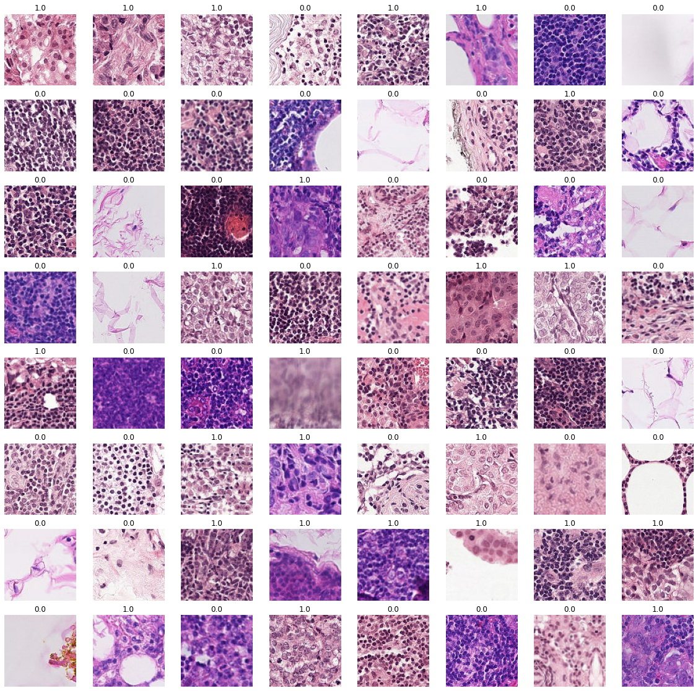

# Hitstopathological-cancer-detection
### This project aims to identify metastatic cancer in small image patches taken from larger digital pathology scans.
### The ipynb contains code to train the models. I have trained EfficientNets (B0 to B5) , Densenet(121,169), resnet(18,50) with 5 fold cossvalidation and heavy augmentation gfro better generalisation using python, Tensorflow and Keras on K80 GPU. 
### The model files have not been uploaded here but you can mail me at sagarkarki136@gmial.om and I will send you the files. 

